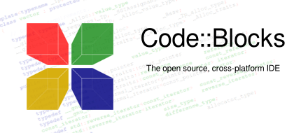

# Code::Blocks

> [!CAUTION]
> This is not an official repository of `Code::Blocks`.



## Information

- website: <https://www.codeblocks.org/>
- sourceforge: <https://sourceforge.net/projects/codeblocks/>
  - [Binaryies](https://sourceforge.net/projects/codeblocks/files/Binaries/)
  - [Sources](https://sourceforge.net/projects/codeblocks/files/Sources/)
- source code (svn):

```shell
svn checkout svn://svn.code.sf.net/p/codeblocks/code/trunk
# or:
svn checkout https://svn.code.sf.net/p/codeblocks/code/trunk
```

- svn to git

```shell
# brew install git-svn
git svn clone https://svn.code.sf.net/p/codeblocks/code/trunk
```

## Similar

- <https://github.com/svn2github/CodeBlocks>
- <https://github.com/oliliango/codeblocks>
- <https://github.com/obfuscated/codeblocks_sf>
- <https://github.com/dreamsdk/codeblocks>

## Structure

```plaintext
├──  Binaries
│  └──  Nightlies
│     └──  2024
│        ├──  CB_20240509_rev13518_win64.7z
│        ├──  Mingw64dlls13.1.0.7z
│        └──  wxmsw32u_gcc_cb_wx324_2D_gcc1310-mingw64.7z
├──  code
│  └──  trunk
│     ├──  debian
│     ├──  m4
│     ├──  src
│     ├──  AUTHORS
│     └── ...
├──  Sources
│  ├──  8.02
│  │  └──  codeblocks-8.02-src.tar.bz2
│  ├──  10.05
│  │  └──  codeblocks-10.05-src.tar.bz2
│  ├──  12.11
│  │  └──  codeblocks_12.11-1.tar.gz
│  ├──  13.12
│  │  └──  codeblocks_13.12-1.tar.gz
│  ├──  13.12-RC1
│  │  └──  codeblocks_13.12-rc1.tar.gz
│  ├──  13.12-RC2
│  │  └──  codeblocks_13.12-rc2.tar.gz
│  ├──  16.01
│  │  └──  codeblocks_16.01.tar.gz
│  ├──  17.12
│  │  └──  codeblocks_17.12.tar.xz
│  └──  20.03
│     ├──  codeblocks-20.03.tar.bz2
│     └──  codeblocks-20.03.tar.xz
```
